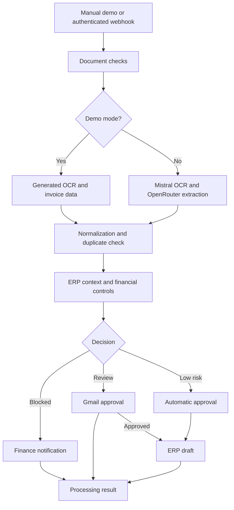

# InvoiceGuard — AI Invoice Processing and Approval

[](https://github.com/kdromanovich/invoiceguard-n8n-invoice-processing/actions/workflows/validate.yml)

[Русская версия](README_RU.md) · [Architecture](docs/ARCHITECTURE.md) · [Setup](docs/SETUP.md) · [Data contracts](docs/DATA_CONTRACTS.md)

An n8n workflow for invoice intake, OCR, structured field extraction, duplicate detection, financial controls, approval routing, and ERP draft creation.

## What the workflow does

1. Accepts a document from a manual demo or an authenticated `POST` webhook.
2. Checks the document URL, MIME type, file size, and optional SHA-256.
3. Creates a fingerprint to prevent repeated processing.
4. Uses Mistral OCR to extract document text.
5. Uses OpenRouter to convert the OCR result into structured invoice fields.
6. Normalizes dates, amounts, vendor details, line items, currency, and confidence.
7. Checks exact and near-duplicate invoices.
8. Retrieves vendor, purchase-order, and goods-receipt data through an ERP adapter.
9. Applies invoice math, matching, vendor, bank-detail, duplicate, and confidence controls.
10. Blocks critical findings or requests human approval when required.
11. Creates an ERP bill in `draft` state after the decision step.
12. Returns the processing result and updates invoice history.

## Architecture



## Decision rules

| Result | Default condition | ERP action |
| --- | --- | --- |
| Blocked | Critical field or control failure, exact duplicate, or risk score of 70+ | No draft |
| Human review | Risk score of 25+, amount of $5,000+, or confidence below 90% | Draft after approval |
| Automatic approval | No blocking condition and all review thresholds are clear | Create draft |
| Rejected or timed out | Manager declines or does not answer in time | No draft |

## Demo

1. Import [`workflows/invoiceguard-ai-invoice-processing.json`](workflows/invoiceguard-ai-invoice-processing.json) into n8n.
2. Leave `INVOICEGUARD_DEMO_MODE` unset or set it to `true`.
3. Click **Run Demo**.
4. Inspect **Write Processing Result and Return**.

The demo uses fictional invoice and ERP data. OCR, AI, ERP, Gmail, and Telegram calls are simulated.

## Live configuration

Follow [SETUP.md](docs/SETUP.md) to configure webhook authentication, Mistral, OpenRouter, the ERP adapter, Gmail, Telegram, and the `INVOICEGUARD_*` variables. The ERP integration creates a draft only; payment and accounting posting are outside this workflow.

## Repository structure

```text
workflows/       n8n workflow file
sample-data/     example documents, ERP responses, and approval payloads
docs/            architecture, setup, and data contracts
scripts/         local workflow checks
tests/           automated tests
```

## License

See [LICENSE](LICENSE).
