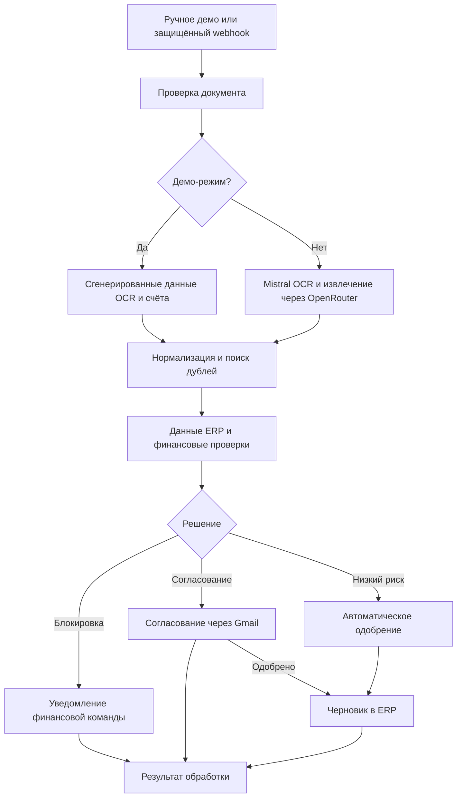

# InvoiceGuard — обработка и согласование счетов с AI

[English version](README.md) · [Архитектура](docs/ARCHITECTURE.md) · [Настройка](docs/SETUP.md) · [Структура данных](docs/DATA_CONTRACTS.md)

Workflow n8n для приёма счетов, распознавания документов, извлечения полей, поиска дублей, финансовых проверок, согласования и создания черновика в ERP.

## Что делает workflow

1. Получает документ из ручного демо или защищённого `POST` webhook.
2. Проверяет URL документа, MIME-тип, размер файла и SHA-256, если он передан.
3. Создаёт отпечаток для защиты от повторной обработки.
4. Извлекает текст документа через Mistral OCR.
5. Преобразует результат OCR в структурированные поля счёта через OpenRouter.
6. Нормализует даты, суммы, данные поставщика, позиции, валюту и уверенность распознавания.
7. Проверяет точные и похожие дубли.
8. Получает данные поставщика, заказа и приёмки через ERP-адаптер.
9. Проверяет расчёты, соответствие заказа и приёмки, поставщика, банковские реквизиты и уровень уверенности.
10. Блокирует критические случаи или запрашивает согласование.
11. После принятия решения создаёт документ в ERP со статусом `draft`.
12. Возвращает результат обработки и обновляет историю счетов.

## Архитектура



## Правила принятия решения

| Результат | Условие | Действие в ERP |
| --- | --- | --- |
| Блокировка | Критическое поле или проверка, точный дубль либо риск 70+ | Черновик не создаётся |
| Согласование | Риск 25+, сумма $5 000+ либо уверенность ниже 90% | Черновик после одобрения |
| Автоматическое одобрение | Нет блокирующих условий и не достигнуты пороги согласования | Создать черновик |
| Отказ или истечение срока | Менеджер отказал или не ответил вовремя | Черновик не создаётся |

## Демонстрационный запуск

1. Импортируйте [`workflows/invoiceguard-ai-invoice-processing.json`](workflows/invoiceguard-ai-invoice-processing.json) в n8n.
2. Оставьте `INVOICEGUARD_DEMO_MODE` пустым или установите `true`.
3. Нажмите **Run Demo**.
4. Посмотрите результат в **Write Processing Result and Return**.

Демонстрация использует вымышленные данные счёта и ERP. Вызовы OCR, AI, ERP, Gmail и Telegram имитируются.

## Рабочая настройка

В [SETUP.md](docs/SETUP.md) описана настройка защиты webhook, Mistral, OpenRouter, ERP-адаптера, Gmail, Telegram и переменных `INVOICEGUARD_*`. Интеграция создаёт только черновик в ERP; проведение документа и оплата не входят в этот workflow.

## Структура репозитория

```text
workflows/       файл workflow n8n
sample-data/     примеры документов, ответов ERP и согласования
docs/            архитектура, настройка и структура данных
scripts/         локальные технические проверки
tests/           автоматические тесты
```

## Лицензия

См. [LICENSE](LICENSE).
