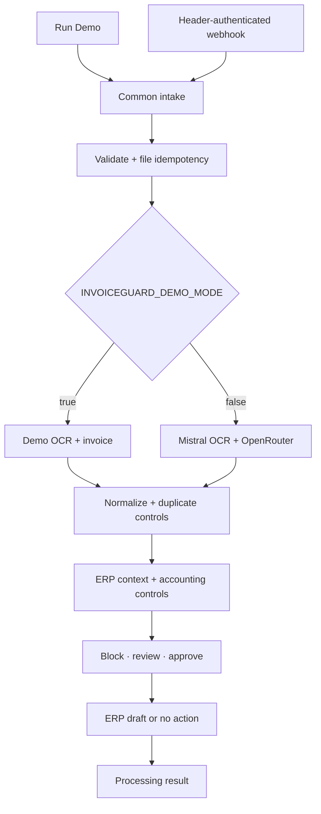
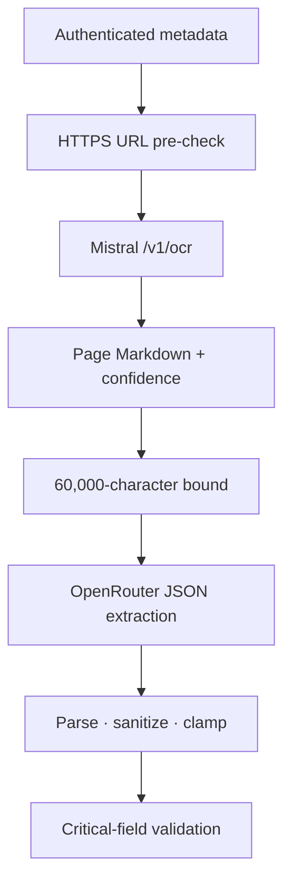

# Architecture

## System boundary

InvoiceGuard is one n8n workflow with a manual demonstration entry point and an authenticated production webhook. Both converge on the same normalization and control pipeline. The demo path replaces every external service with deterministic data; the live path integrates five trust boundaries.

## Processing stages

| Stage | Main nodes | Responsibility | Output invariant |
| --- | --- | --- | --- |
| Intake | `Load Demo Invoice`, `Invoice Intake Webhook`, `Normalize Intake Envelope` | Unify manual and webhook envelopes | `intake_raw`, request ID, timestamp, source |
| Document gate | `Runtime Configuration`, `Validate Document Intake`, `Is Document Valid?` | Bound metadata and require an allowed HTTPS document declaration | Normalized `document` or explicit rejection |
| File idempotency | `Create File Idempotency Key`, `Is Duplicate File?` | Prefer supplied SHA-256; otherwise fingerprint stable URL/name/size | File identity and duplicate state |
| OCR | demo node or `Mistral: Extract OCR Text` | Produce bounded Markdown text and OCR confidence | `ocr.status`, text, page count, confidence |
| Extraction | demo invoice or OpenRouter branch | Extract, parse, normalize, and validate invoice fields | Stable `invoice` object plus critical-missing list |
| Business duplicate detection | `Detect Duplicate Invoice` | Compare vendor/number and fuzzy number/amount/date history | Exact, near, or no-match result |
| ERP context | demo records or ERP GET adapter | Retrieve vendor, PO, and goods receipt | Normalized nullable context |
| Accounting controls | `Run Financial and 3-Way Controls` | Evaluate deterministic invoice, vendor, PO, receipt, bank, and confidence rules | Boolean controls and structured flags |
| Policy | `Calculate Risk and Decision` | Apply hard blocks and review thresholds | `blocked`, `human_review`, or `auto_approved` |
| Human gate | Gmail send-and-wait | Allow a finance manager to approve or decline | Explicit approval state |
| ERP draft | simulated node or ERP POST adapter | Create a non-posted bill draft after approval | Draft ID required for success |
| Result | `Write Processing Result and Return` | Record outcome, history, and metrics; return a compact object | Stable terminal result |

## Live extraction boundary

The provider receives the externally reachable or signed document URL. The URL, size, MIME type, and SHA-256 are declarations from the caller rather than properties confirmed from the downloaded file.

## Control catalog

| Control | Severity / points | Decision effect |
| --- | ---: | --- |
| Missing critical invoice field | Critical / 40 each | Hard block |
| Invoice subtotal + tax mismatch | High / 35 | Review or combined block |
| Line-item sum mismatch | High / 25 | Human review |
| Future invoice date | Medium / 15 | Adds risk |
| Due date before invoice date | High / 25 | Human review |
| Exact duplicate | Critical / 100 | Hard block |
| Near duplicate | High / 60 | Human review unless combined score blocks |
| Extraction confidence < 75% | High / 30 | Human review |
| Extraction confidence 75–89% | Medium / 15 | Human review due confidence policy |
| PO missing | Medium / 25 | Human review |
| PO status not open/approved/partially received | High / 30 | Human review |
| Vendor mismatch | Critical / 50 | Hard block |
| Vendor not approved | Critical / 50 | Hard block |
| Currency mismatch | High / 30 | Human review |
| PO total mismatch | High / 30 | Human review |
| Bank-account last four changed | Critical / 60 | Hard block |
| Quantity exceeds receipt | High / 30 | Human review |
| Goods receipt missing | Medium / 25 | Human review |

Risk points are additive and capped at 100. A critical flag blocks even when its numeric points are below the 70-point block threshold.

## State model

The workflow uses n8n global workflow static data for:

- file fingerprints with `processing` and `completed` state;
- completed invoice identity/history records;
- daily processed, draft, blocked, and rejected counters.

This keeps the demo self-contained. It is not atomic across workers and is not an immutable accounting ledger.

## Failure behavior

| Failure | Behavior |
| --- | --- |
| Invalid document declaration | Reject before OCR |
| Replayed file fingerprint | Ignore before OCR |
| Mistral transport/empty response | Return `ocr_failed`; no extraction or ERP action |
| OpenRouter failure/invalid JSON | Produce empty fallback; critical fields then block |
| ERP context unavailable | Missing PO adds review-level risk |
| Critical control | Block and attempt Telegram finance alert |
| Telegram alert failure | Record failed alert; remain blocked |
| Approval rejection/unknown/timeout | No ERP draft |
| ERP draft HTTP failure | Execution fails; no false success |
| ERP 2xx response without bill ID | Explicit error; refuse `draft_created` |
